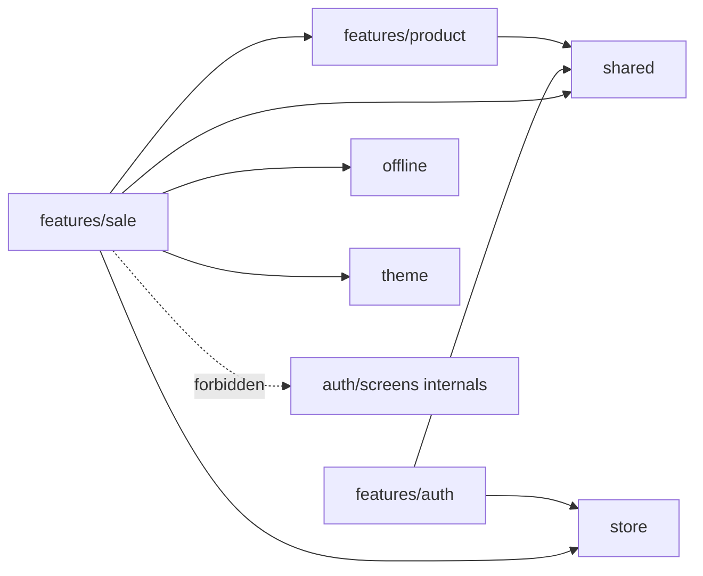
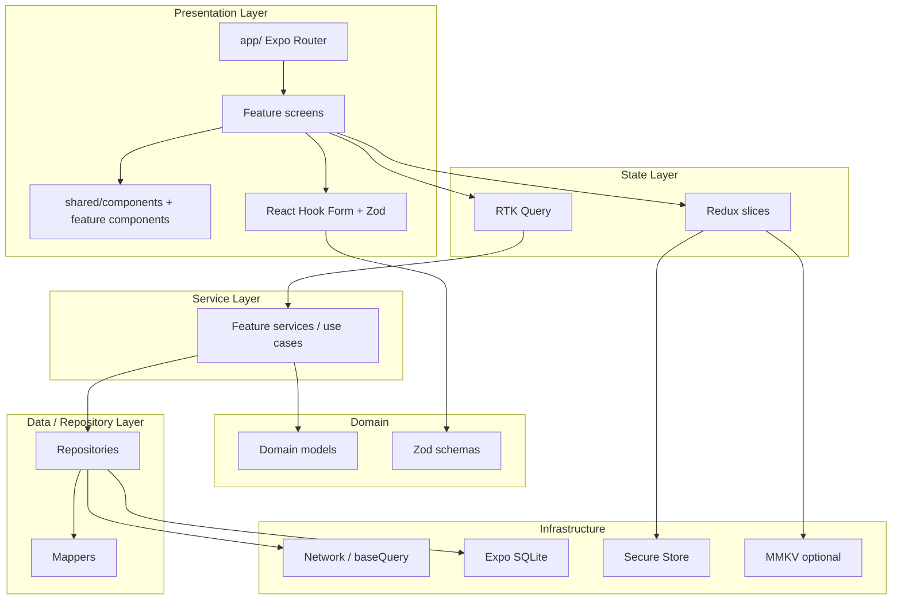
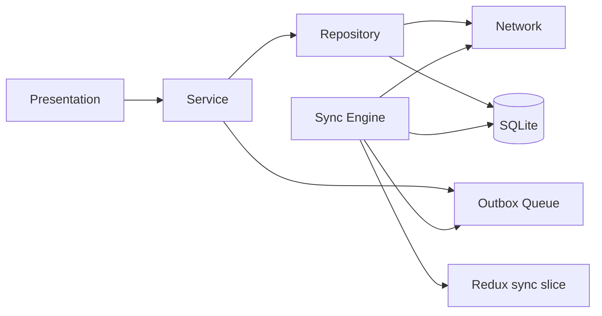
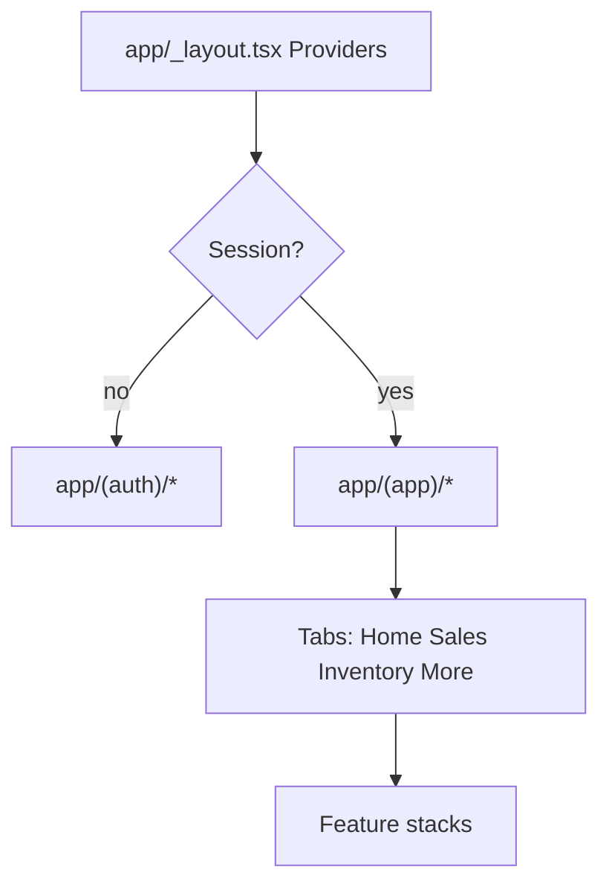
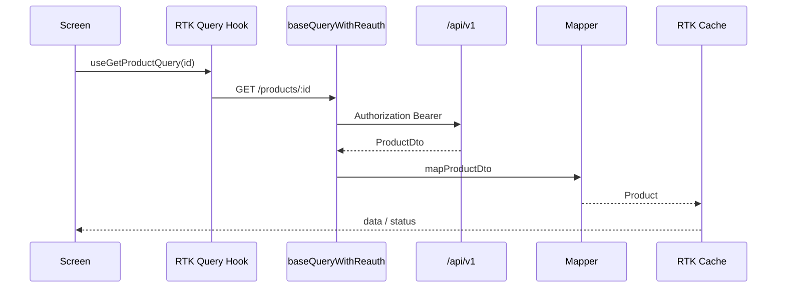
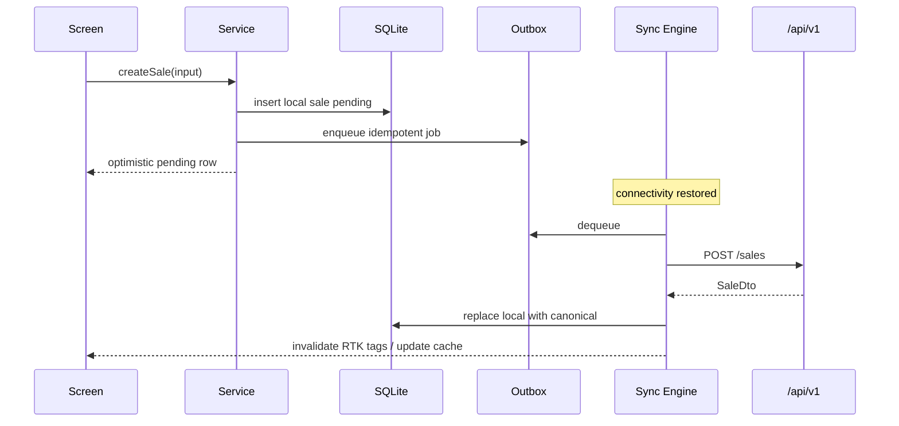

# Architecture — ShopMaster Mobile

This document defines the production architecture for ShopMaster Mobile: **feature-based organization** combined with **Clean Architecture** boundaries, plus explicit responsibilities for repository, service, presentation, data, offline, network, navigation, state, and theme layers.

Engineers and AI agents must follow these boundaries. Cross-layer shortcuts (for example, screens importing Axios directly, or SQLite queries inside UI components) are defects.

---

## 1. Goals of the Architecture

1. Keep ERP modules independently deliverable and testable.  
2. Isolate UI from API and SQLite details.  
3. Make offline/sync a first-class layer, not an afterthought.  
4. Standardize server communication through RTK Query.  
5. Enforce design-system consistency through a dedicated theme layer.  
6. Remain compatible with the ShopMaster Express + Prisma API at `/api/v1/*`.

---

## 2. Feature-Based Architecture

Each backend module maps to a feature folder:

```text
src/features/<feature>/
```

Examples: `auth`, `users`, `roles`, `permissions`, `organization`, `settings`, `customer`, `supplier`, `brand`, `category`, `warehouse`, `product`, `inventory`, `purchase`, `purchaseReturn`, `sale`, `saleReturn`, `payment`, `expense`, `dashboard`, `reports`, `notification`, `audit`, `upload`.

### 2.1 Feature public surface

A feature exposes a **small public API** via `index.ts`:

```ts
// src/features/sale/index.ts
export * from './api/saleApi';
export * from './hooks/useSalePermissions';
export { SaleListScreen } from './screens/SaleListScreen';
export { SaleDetailScreen } from './screens/SaleDetailScreen';
export { SaleFormScreen } from './screens/SaleFormScreen';
```

Other features import from `@/features/sale`, never from deep internal paths of another feature (except shared kernels in `src/shared`).

### 2.2 Feature internal layout (typical)

```text
src/features/sale/
├── api/                 # RTK Query endpoints (injectEndpoints)
├── components/          # Feature-only UI
├── hooks/               # Feature hooks
├── models/              # Domain types
├── mappers/             # DTO ↔ domain
├── repositories/        # Data access abstractions
├── services/            # Use-case orchestration
├── schemas/             # Zod schemas
├── screens/             # Route-backed screens
├── slices/              # Optional feature Redux slice
├── types/               # Feature-local types
├── utils/               # Feature-local helpers
└── index.ts
```

Not every feature needs every folder. Prefer creating a folder when the first real file appears.

### 2.3 Feature dependency rules



**Allowed:** feature → `shared`, `store`, `theme`, `offline`, `navigation`, `types`, and other features’ **public** exports.  
**Forbidden:** feature screen → another feature’s repository/SQLite; UI → raw `fetch` bypassing `baseApi` (except rare upload progress cases wrapped in repository).

---

## 3. Clean Architecture Mapping



### Dependency direction

Dependencies point **inward** toward domain models. Infrastructure details never leak into screens.

| From | May depend on |
|---|---|
| Presentation | State hooks, shared UI, theme, navigation helpers, Zod forms |
| State (RTK/Redux) | Services/repositories via endpoint `queryFn`/`mutationFn`, shared types |
| Services | Repositories, domain models, offline queue APIs |
| Repositories | Network clients, SQLite DAOs, mappers |
| Infrastructure | Platform SDKs only |

---

## 4. Presentation Layer

**Location:** `app/` routes + `src/features/*/screens` + `src/shared/components`.

### Responsibilities

- Render UI using design-system components.
- Wire user intents to RTK Query hooks or Redux actions.
- Own form state with React Hook Form; validate with Zod.
- Implement screen states: loading, empty, error, offline, retry, pull-to-refresh.
- Apply theme tokens; no raw hex in screens.
- Drive navigation via Expo Router.

### Non-responsibilities

- HTTP URL construction and auth header injection.
- SQL statements.
- Business calculations that belong in services (tax totals may be mirrored for UX but canonical math should match server rules in shared helpers).

### Example screen wiring

```tsx
// Conceptual — SaleListScreen
export function SaleListScreen() {
  const { data, error, isLoading, isFetching, refetch } = useGetSalesQuery(filters);
  const isOffline = useNetworkStatus();

  if (isLoading) return <SaleListSkeleton />;
  if (error) return <ErrorState onRetry={refetch} error={error} />;
  if (!data?.items.length) return <EmptyState title="No sales yet" />;

  return (
    <SaleList
      items={data.items}
      refreshing={isFetching}
      onRefresh={refetch}
      offline={isOffline}
    />
  );
}
```

---

## 5. Service Layer

**Location:** `src/features/*/services`.

Services orchestrate use cases that are more than a single CRUD call:

- Create sale offline → write local draft + enqueue outbox job.
- Receive purchase → validate lines → call API → update local stock cache.
- Login → persist tokens → bootstrap user/org/settings queries.

```ts
// Conceptual
export async function createSaleUseCase(input: CreateSaleInput, deps: SaleDeps) {
  const parsed = createSaleSchema.parse(input);

  if (!deps.network.isOnline) {
    const local = await deps.saleRepo.createLocalDraft(parsed);
    await deps.outbox.enqueue({
      type: 'sale.create',
      payload: parsed,
      localId: local.id,
      idempotencyKey: local.idempotencyKey,
    });
    return local;
  }

  return deps.saleRepo.createRemote(parsed);
}
```

Keep services **pure where possible** (inject deps) for unit testing.

---

## 6. Repository Pattern

**Location:** `src/features/*/repositories` and shared offline DAOs under `src/offline`.

Repositories hide whether data comes from API, SQLite, or both.

```ts
export interface ProductRepository {
  list(params: ProductListParams): Promise<Paginated<Product>>;
  getById(id: string): Promise<Product | null>;
  upsertLocal(product: Product): Promise<void>;
  searchLocal(query: string): Promise<Product[]>;
}
```

### Online repository

Wraps RTK Query or fetch wrappers; maps DTO → domain.

### Offline / cache repository

Reads/writes SQLite tables; used by sync engine and offline screens.

### Facade repository (common)

```ts
export function createProductRepository(api: ProductApi, db: ProductDao): ProductRepository {
  return {
    async list(params) {
      try {
        const remote = await api.list(params);
        await db.replacePage(params, remote.items);
        return remote;
      } catch (e) {
        if (isNetworkError(e)) return db.list(params);
        throw e;
      }
    },
    // ...
  };
}
```

---

## 7. Data Layer

**Location:** mappers, DTO types, API slices, SQLite schemas.

### Mappers

Every remote DTO is mapped explicitly:

```ts
export function mapSaleDto(dto: SaleDto): Sale {
  return {
    id: dto.id,
    number: dto.number,
    status: dto.status,
    paymentStatus: dto.paymentStatus,
    customerId: dto.customerId ?? null,
    warehouseId: dto.warehouseId,
    items: dto.items.map(mapSaleItemDto),
    subtotal: Money.from(dto.subtotal),
    total: Money.from(dto.total),
    createdAt: new Date(dto.createdAt),
  };
}
```

### Why mappers exist

- Protect UI from backend renames.
- Normalize nullability and enums.
- Convert date strings and decimal money representations consistently.

---

## 8. Offline Layer

**Location:** `src/offline/**`.

### Components

| Piece | Role |
|---|---|
| SQLite database | Cached entities + metadata |
| Outbox / queue | Durable pending mutations |
| Sync engine | Drain queue, pull deltas, resolve conflicts |
| Connectivity monitor | Online/offline signals |
| Conflict policies | Per-entity rules (server-wins default for most ERP docs) |



### Principles

1. Reads may serve from cache when offline.  
2. Writes that must work offline go to SQLite **and** outbox.  
3. Sync uses idempotency keys.  
4. UI always shows pending / failed / synced state for local rows.  
5. Financial documents follow server validation on flush; failures surface actionable errors.

Detailed design: [OFFLINE_FIRST.md](./OFFLINE_FIRST.md), [SYNC_ENGINE.md](./SYNC_ENGINE.md), [DATABASE_GUIDE.md](./DATABASE_GUIDE.md).

---

## 9. Network Layer

**Location:** `src/store/baseApi.ts` (primary), helpers under `src/shared/api` or `src/offline/network`.

### Responsibilities

- Compose `EXPO_PUBLIC_API_BASE_URL` + path.
- Attach `Authorization: Bearer <accessToken>`.
- On `401`, attempt refresh once, replay request, or force logout.
- Normalize API errors into a typed `AppError`.
- Support multipart uploads for `/uploads`.

### Conceptual base query

```ts
const rawBaseQuery = fetchBaseQuery({
  baseUrl: process.env.EXPO_PUBLIC_API_BASE_URL,
  prepareHeaders: (headers, { getState }) => {
    const token = selectAccessToken(getState() as RootState);
    if (token) headers.set('authorization', `Bearer ${token}`);
    headers.set('accept', 'application/json');
    return headers;
  },
});

export const baseQueryWithReauth: BaseQueryFn = async (args, api, extra) => {
  let result = await rawBaseQuery(args, api, extra);
  if (result.error && result.error.status === 401) {
    const refreshed = await api.dispatch(refreshTokens());
    if (refreshTokens.fulfilled.match(refreshed)) {
      result = await rawBaseQuery(args, api, extra);
    } else {
      api.dispatch(logout());
    }
  }
  return result;
};
```

All feature endpoints **inject** into a single `baseApi` to share cache tags and middleware.

---

## 10. Navigation Layer

**Location:** `app/` (Expo Router file routes) + `src/navigation` (types/helpers).

### Responsibilities

- Define typed routes and params.
- Auth gate: unauthenticated users only see `(auth)` group.
- Permission gate: hide unauthorized tabs/screens.
- Deep links for notifications (sale detail, etc.).
- Keep business logic out of `_layout.tsx` files beyond providers and redirects.



Example route helpers:

```ts
// src/navigation/paths.ts
export const paths = {
  saleDetail: (id: string) => `/sales/${id}` as const,
  productEdit: (id: string) => `/products/${id}/edit` as const,
  login: '/login' as const,
};
```

---

## 11. State Layer

**Location:** `src/store/**` + feature `api/` and optional `slices/`.

### Split of responsibilities

| Kind of state | Tool |
|---|---|
| Server entities, lists, details | **RTK Query** |
| Auth session flags, sync status, UI chrome | **Redux Toolkit slices** |
| Ephemeral form fields | **React Hook Form local state** |
| Transient component UI | **React `useState`** |

### Store shape (conceptual)

```ts
export const store = configureStore({
  reducer: {
    [baseApi.reducerPath]: baseApi.reducer,
    auth: authReducer,
    sync: syncReducer,
    ui: uiReducer,
  },
  middleware: (gDM) => gDM().concat(baseApi.middleware),
});
```

Decision guide: [STATE_MANAGEMENT.md](./STATE_MANAGEMENT.md).  
RTK Query details: [RTK_QUERY_GUIDE.md](./RTK_QUERY_GUIDE.md).

---

## 12. Theme Layer

**Location:** `src/theme/**`, `tailwind.config.js`, `global.css`.

### Responsibilities

- Define MD3 color roles for light and dark (premium green brand) in `tokens.ts`.
- Export tokens to **NativeWind / Tailwind CSS v3** via `tailwind.config.js`.
- Inter typography scale as Tailwind `fontSize` + `fontFamily` keys.
- 8-point spacing system as Tailwind `spacing` keys.
- Elevation / radius tokens.
- `ThemeProvider` applies `dark` class and syncs with user settings (`LIGHT` | `DARK` | system).
- `cn()` utility (`clsx` + `tailwind-merge`) for variant composition.

Screens consume tokens via `className`:

```tsx
<View className="bg-surface p-4 dark:bg-surface-dark">
  <Text className="font-sans-semibold text-title text-foreground">Products</Text>
</View>
```

Never hard-code brand greens in feature code. Use shared UI primitives from `src/shared/components/ui/`. See [TAILWIND_GUIDE.md](./TAILWIND_GUIDE.md), [THEME_GUIDE.md](./THEME_GUIDE.md), [COLOR_SYSTEM.md](./COLOR_SYSTEM.md), [TYPOGRAPHY.md](./TYPOGRAPHY.md), [SPACING_SYSTEM.md](./SPACING_SYSTEM.md).

---

## 13. Cross-Cutting Concerns

### 13.1 Authentication

- Register requires `organizationName`.
- Refresh rotation coordinated in network layer + auth slice.
- Secure Store for refresh token; memory for access token.

### 13.2 Authorization

- Permission strings from API (e.g. `products:write`).
- `usePermission('products:write')` hides/disables controls.
- Mutations still expect server `403` handling.

### 13.3 Error handling

- Map HTTP errors → user-safe messages.
- Form errors from Zod.
- Offline errors → queue or friendly banner.
- Fatal boundaries at root layout.

### 13.4 Analytics / logging

- No secrets in logs.
- Prefer structured events: `sale_created`, `sync_failed`.

---

## 14. End-to-End Request Flow (Online)



---

## 15. End-to-End Mutation Flow (Offline)



---

## 16. Provider Stack

Root layout composition order (outer → inner):

1. Gesture Handler root  
2. Redux `Provider`  
3. Theme provider (MD3 + tokens)  
4. Safe area / bottom sheet modal provider  
5. Expo Router slot  
6. Auth bootstrap / splash gate  

Reanimated and FlashList require no special provider beyond Babel/plugin setup.

---

## 17. Anti-Patterns (Rejected)

| Anti-pattern | Why rejected |
|---|---|
| Global “utils dump” for business rules | Becomes untestable spaghetti |
| Screens calling SQLite | Breaks Clean Architecture; untestable UI |
| Multiple HTTP clients per feature | Divergent auth/refresh behavior |
| Storing refresh tokens in MMKV/AsyncStorage | Insecure |
| Copy-pasted color hex values | Breaks theming and dark mode |
| Flat Redux for all server lists | Reinvents RTK Query poorly |
| Starting multiple modules unfinished | Violates delivery discipline |

---

## 18. Evolution Rules

1. New ERP capability → new/extended **feature** module, not a random shared dump.  
2. New cross-cutting UI → `src/shared/components` only if reused by ≥2 features.  
3. New persistence concern → `src/offline` with migration notes in Database guide.  
4. Architecture changes require updates to this file and [FOLDER_STRUCTURE.md](./FOLDER_STRUCTURE.md) in the same PR.

---

## 19. Related Documents

- [PROJECT_OVERVIEW.md](./PROJECT_OVERVIEW.md) — product context  
- [FOLDER_STRUCTURE.md](./FOLDER_STRUCTURE.md) — concrete directories  
- [STATE_MANAGEMENT.md](./STATE_MANAGEMENT.md) — state decisions  
- [AUTHENTICATION.md](./AUTHENTICATION.md) — auth flows  
- [OFFLINE_FIRST.md](./OFFLINE_FIRST.md) — offline contracts  
- [NAVIGATION_GUIDE.md](./NAVIGATION_GUIDE.md) — routing details  
- [SECURITY_GUIDE.md](./SECURITY_GUIDE.md) — threat model & controls  
