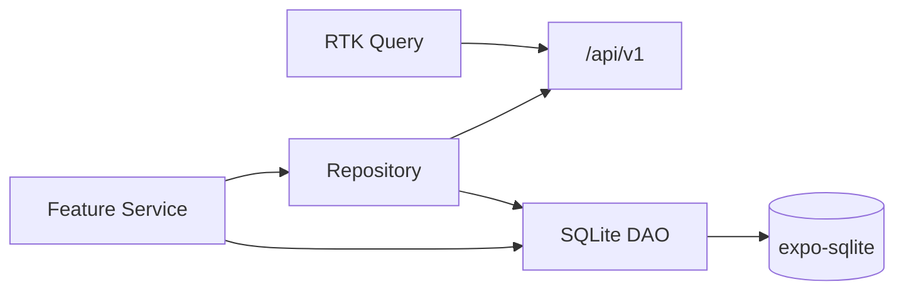

# Database Guide — Expo SQLite

Local persistence for offline cache, sync outbox, and metadata. Server remains source of truth for business data.

---

## Table of Contents

1. [Role in Architecture](#role-in-architecture)
2. [Technology](#technology)
3. [Schema Overview](#schema-overview)
4. [Table Definitions](#table-definitions)
5. [Migrations](#migrations)
6. [Repository Pattern](#repository-pattern)
7. [DAO Layer](#dao-layer)
8. [Query Conventions](#query-conventions)
9. [Testing](#testing)
10. [Related Docs](#related-docs)

---

## Role in Architecture



| Concern | Storage |
|---|---|
| Authoritative business data | Server PostgreSQL via API |
| Read cache (lists, details) | SQLite `cache_*` tables |
| Pending mutations | SQLite `outbox` table |
| Sync cursor / metadata | SQLite `sync_meta` |
| Auth refresh token | Expo Secure Store (not SQLite) |
| Theme preference | MMKV (not SQLite) |

---

## Technology

- **expo-sqlite** (synchronous or async API per Expo SDK — use project-standard wrapper in `src/offline/db/client.ts`)
- **SQL migrations** as numbered `.sql` files
- **No ORM** — typed DAOs with prepared statements

---

## Schema Overview

| Table group | Purpose |
|---|---|
| `cache_*` | Denormalized entity snapshots for offline read |
| `outbox` | Queued mutations awaiting sync |
| `sync_meta` | Last sync timestamps, cursors, schema version |
| `conflict_log` | Optional audit of resolved conflicts |

---

## Table Definitions

### `sync_meta`

```sql
CREATE TABLE IF NOT EXISTS sync_meta (
  key TEXT PRIMARY KEY NOT NULL,
  value TEXT NOT NULL,
  updated_at INTEGER NOT NULL
);
```

Keys: `schema_version`, `last_full_sync_at`, `device_id`.

### `outbox`

```sql
CREATE TABLE IF NOT EXISTS outbox (
  id TEXT PRIMARY KEY NOT NULL,
  entity_type TEXT NOT NULL,
  entity_id TEXT,
  operation TEXT NOT NULL CHECK (operation IN ('CREATE', 'UPDATE', 'DELETE')),
  payload TEXT NOT NULL,
  idempotency_key TEXT NOT NULL UNIQUE,
  status TEXT NOT NULL DEFAULT 'PENDING'
    CHECK (status IN ('PENDING', 'IN_FLIGHT', 'FAILED', 'DONE')),
  retry_count INTEGER NOT NULL DEFAULT 0,
  last_error TEXT,
  created_at INTEGER NOT NULL,
  updated_at INTEGER NOT NULL
);

CREATE INDEX IF NOT EXISTS idx_outbox_status_created
  ON outbox (status, created_at);
```

### `cache_products` (example)

```sql
CREATE TABLE IF NOT EXISTS cache_products (
  id TEXT PRIMARY KEY NOT NULL,
  organization_id TEXT NOT NULL,
  payload TEXT NOT NULL,
  updated_at INTEGER NOT NULL,
  deleted INTEGER NOT NULL DEFAULT 0
);

CREATE INDEX IF NOT EXISTS idx_cache_products_org
  ON cache_products (organization_id, deleted);
```

`payload` stores JSON string of API DTO. Mappers convert to domain types.

Similar tables: `cache_customers`, `cache_sales`, `cache_categories`, etc. — add per module when offline read is required.

### `conflict_log` (optional v1)

```sql
CREATE TABLE IF NOT EXISTS conflict_log (
  id TEXT PRIMARY KEY NOT NULL,
  entity_type TEXT NOT NULL,
  entity_id TEXT NOT NULL,
  local_payload TEXT NOT NULL,
  server_payload TEXT NOT NULL,
  resolution TEXT NOT NULL,
  created_at INTEGER NOT NULL
);
```

---

## Migrations

```text
src/offline/db/migrations/
├── 001_init.sql
├── 002_outbox_index.sql
└── index.ts
```

```typescript
// src/offline/db/migrations/index.ts
import * as SQLite from 'expo-sqlite';
import { migration001 } from './001_init.sql'; // loaded as string via bundler

const MIGRATIONS: { version: number; sql: string }[] = [
  { version: 1, sql: migration001 },
];

export async function runMigrations(db: SQLite.SQLiteDatabase) {
  const row = await db.getFirstAsync<{ value: string }>(
    "SELECT value FROM sync_meta WHERE key = 'schema_version'",
  );
  let current = row ? Number(row.value) : 0;

  for (const m of MIGRATIONS) {
    if (m.version > current) {
      await db.execAsync(m.sql);
      await db.runAsync(
        `INSERT OR REPLACE INTO sync_meta (key, value, updated_at) VALUES (?, ?, ?)`,
        ['schema_version', String(m.version), Date.now()],
      );
      current = m.version;
    }
  }
}
```

Bump version on every schema change. Never edit applied migration files — add new numbered file.

---

## Repository Pattern

```typescript
// src/features/product/repositories/productRepository.ts
export interface ProductRepository {
  listFromCache(orgId: string): Promise<Product[]>;
  getFromCache(id: string): Promise<Product | null>;
  upsertCache(product: Product): Promise<void>;
  enqueueCreate(dto: CreateProductDto): Promise<string>;
}
```

Implementation delegates to `productDao` + `outbox`:

```typescript
async enqueueCreate(dto: CreateProductDto): Promise<string> {
  const id = generateLocalId();
  await outbox.enqueue({
    id: generateOutboxId(),
    entityType: 'product',
    entityId: id,
    operation: 'CREATE',
    payload: JSON.stringify({ ...dto, localId: id }),
    idempotencyKey: `product:create:${id}`,
  });
  return id;
}
```

Screens never import DAOs directly — go through repository or RTK Query + offline middleware.

---

## DAO Layer

```text
src/offline/dao/
├── productDao.ts
├── customerDao.ts
├── saleDao.ts
└── metaDao.ts
```

```typescript
// src/offline/dao/productDao.ts
export const productDao = {
  async upsert(db: Database, row: CacheRow<ProductDto>) {
    await db.runAsync(
      `INSERT OR REPLACE INTO cache_products (id, organization_id, payload, updated_at, deleted)
       VALUES (?, ?, ?, ?, ?)`,
      [row.id, row.organizationId, JSON.stringify(row.payload), row.updatedAt, row.deleted ? 1 : 0],
    );
  },

  async listByOrg(db: Database, organizationId: string): Promise<ProductDto[]> {
    const rows = await db.getAllAsync<{ payload: string }>(
      `SELECT payload FROM cache_products WHERE organization_id = ? AND deleted = 0 ORDER BY updated_at DESC`,
      [organizationId],
    );
    return rows.map((r) => JSON.parse(r.payload));
  },
};
```

---

## Query Conventions

1. **Parameterized queries only** — never string-interpolate user input.
2. **JSON payload** — single column per entity for flexibility; index by `id`, `organization_id`, `updated_at`.
3. **Soft delete** — `deleted = 1` in cache; purge on full sync optional.
4. **Transactions** — wrap outbox insert + cache optimistic update in `db.withTransactionAsync`.
5. **Timestamps** — store Unix ms in `INTEGER` columns.

---

## Testing

- Unit test DAOs with in-memory SQLite (or mocked `runAsync` / `getAllAsync`).
- Integration test: enqueue → sync engine processes → `status = DONE`.
- Reset DB helper for tests: `DELETE FROM outbox; DELETE FROM cache_*;`

---

## Related Docs

- [OFFLINE_FIRST.md](./OFFLINE_FIRST.md) — product principles
- [SYNC_ENGINE.md](./SYNC_ENGINE.md) — outbox processing
- [ARCHITECTURE.md](./ARCHITECTURE.md) — offline layer boundaries
