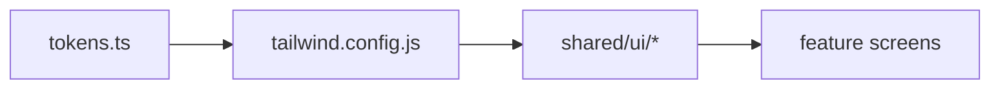

# Design System — ShopMaster Mobile

Visual language for a premium, minimal ERP mobile app. Styling is **NativeWind (Tailwind CSS v3)** on top of **Material Design 3** semantics and a **green brand palette**.

---

## Table of Contents

1. [Design Principles](#design-principles)
2. [Stack](#stack)
3. [Token Layers](#token-layers)
4. [Border Radius](#border-radius)
5. [Elevation & Shadows](#elevation--shadows)
6. [Icons](#icons)
7. [Motion Tokens](#motion-tokens)
8. [Component Inventory](#component-inventory)
9. [Screen Composition](#screen-composition)
10. [Related Docs](#related-docs)

---

## Design Principles

Inspired by Google Wallet, Google Home, Apple Wallet, Apple Settings, and Notion Mobile:

| Principle | Implementation |
|---|---|
| Minimal | One primary action per screen region; hide advanced fields behind sheets |
| Whitespace | `px-4`, `gap-6` between sections; never cram forms |
| Calm color | Green primary; neutrals dominate; status colors only where meaningful |
| Large touch targets | `min-h-12` on all pressables |
| Rounded corners | `rounded-lg` cards, `rounded-full` avatars/chips |
| Subtle depth | `shadow-sm` on cards; avoid heavy borders |
| Fast motion | 150–250ms transitions; see [ANIMATION_GUIDELINES.md](./ANIMATION_GUIDELINES.md) |
| Dark mode | Every screen tested in light and dark |

---

## Stack

| Layer | Technology |
|---|---|
| Styling | NativeWind v4 + Tailwind CSS v3 |
| Tokens | `src/theme/tokens.ts` → `tailwind.config.js` |
| Fonts | Inter (4 weights) via `expo-font` |
| Icons | `@expo/vector-icons` (MaterialCommunityIcons primary) + `react-native-svg` for custom |
| Images | `expo-image` |
| Lists | `@shopify/flash-list` |
| Sheets | `@gorhom/bottom-sheet` |
| Motion | `react-native-reanimated` + Lottie for empty/success |

---

## Token Layers



Feature screens use **primitives + Tailwind utilities**. They do not define new color hex or font sizes.

---

## Border Radius

| Token | Value | Tailwind | Use |
|---|---|---|---|
| Small | 8px | `rounded-sm` | Chips, small buttons |
| Medium | 12px | `rounded-md` | Inputs |
| Large | 16px | `rounded-lg` | Cards, dialogs |
| XL | 24px | `rounded-xl` | Bottom sheet top corners |
| Full | 9999px | `rounded-full` | FAB, avatars, pills |

Default card: `rounded-lg`.

---

## Elevation & Shadows

```javascript
// tailwind.config.js boxShadow (conceptual — NativeWind maps to RN shadow)
boxShadow: {
  sm: '0 1px 2px rgba(15, 23, 42, 0.06)',
  md: '0 4px 12px rgba(15, 23, 42, 0.08)',
  lg: '0 8px 24px rgba(15, 23, 42, 0.12)',
},
```

Shared `Card` component:

```tsx
<View
  className={cn(
    'rounded-lg bg-surface p-4 shadow-sm dark:bg-surface-dark',
    className,
  )}
  style={{ elevation: 2 }} // Android
>
```

---

## Icons

| Context | Size | Class |
|---|---|---|
| Inline with body | 20 | `h-5 w-5` |
| List leading | 24 | `h-6 w-6` |
| App bar action | 24 | `h-6 w-6` |
| Empty state | 64–96 | `h-24 w-24` |
| Tab bar | 24 | per Expo Router tab config |

Icon color follows text: `text-foreground`, `text-muted`, `text-primary`.

---

## Motion Tokens

| Token | Duration | Easing |
|---|---|---|
| `fast` | 150ms | ease-out |
| `normal` | 200ms | ease-in-out |
| `slow` | 300ms | ease-in-out |
| `sheet` | 250ms | spring (Reanimated) |

Use Reanimated for press scale (`0.98`), sheet snap, and list item fade-in. Never block interaction with long animations.

---

## Component Inventory

All live under `src/shared/components/ui/`. See [COMPONENT_GUIDELINES.md](./COMPONENT_GUIDELINES.md) for APIs.

| Category | Components |
|---|---|
| Actions | `Button`, `IconButton`, `FAB`, `TextButton` |
| Surfaces | `Card`, `Surface`, `Divider` |
| Inputs | `TextField`, `SearchField`, `Switch`, `Checkbox`, `Radio`, `Dropdown` |
| Feedback | `Loader`, `Skeleton`, `EmptyState`, `ErrorState`, `Badge`, `Snackbar`, `Toast` |
| Overlays | `Dialog`, `BottomSheet`, `ActionSheet` |
| Navigation | `AppBar`, `Tabs`, `TabBar` |
| Data display | `ListItem`, `Avatar`, `Chip`, `StatCard`, `Chart` (wrapper) |
| Typography | `Text` |

---

## Screen Composition

Standard screen skeleton:

```tsx
<SafeAreaView className="flex-1 bg-background dark:bg-background-dark" edges={['top']}>
  <AppBar title="Products" />
  <View className="flex-1 px-4">
    {/* Search + filters */}
  </View>
</SafeAreaView>
```

| Region | Spacing |
|---|---|
| App bar | Full width, `h-14` |
| Content | `px-4`, scrollable `flex-1` |
| FAB | `absolute bottom-4 right-4` |
| Bottom tab | Expo Router tabs — height per platform |

---

## Related Docs

| Document | Content |
|---|---|
| [TAILWIND_GUIDE.md](./TAILWIND_GUIDE.md) | NativeWind setup and class rules |
| [THEME_GUIDE.md](./THEME_GUIDE.md) | ThemeProvider, dark mode |
| [COLOR_SYSTEM.md](./COLOR_SYSTEM.md) | Palette |
| [TYPOGRAPHY.md](./TYPOGRAPHY.md) | Inter scale |
| [SPACING_SYSTEM.md](./SPACING_SYSTEM.md) | 8pt grid |
| [COMPONENT_GUIDELINES.md](./COMPONENT_GUIDELINES.md) | Component specs |
| [UI_GUIDELINES.md](./UI_GUIDELINES.md) | Layout patterns |
| [ANIMATION_GUIDELINES.md](./ANIMATION_GUIDELINES.md) | Motion |
