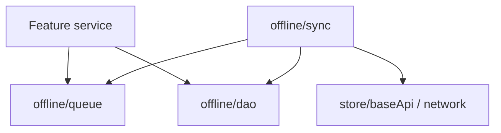
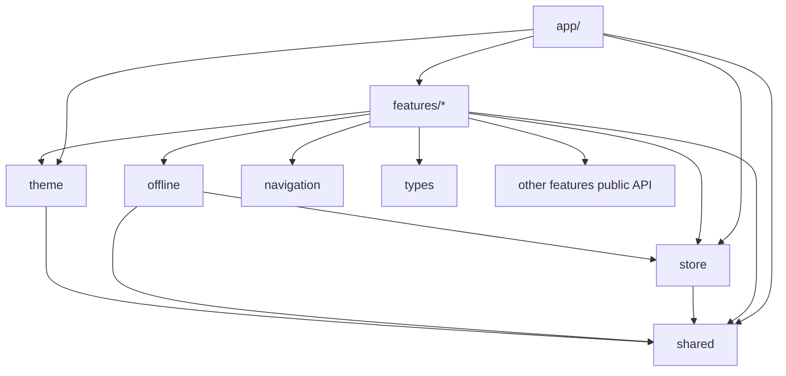

# Folder Structure — ShopMaster Mobile

This document explains the **proposed and mandatory** folder structure for `mobileApp/`. Every directory exists for a reason. Naming conventions at the end are normative.

If a new folder is required, update this document in the same PR.

---

## 1. Top-Level Layout

```text
mobileApp/
├── docs/                         # Production documentation (this set)
├── global.css                    # Tailwind directives (@tailwind base/components/utilities)
├── tailwind.config.js            # NativeWind preset + design token extensions
├── nativewind-env.d.ts           # className TypeScript support
├── app/                          # Expo Router routes & root providers
├── src/
│   ├── features/                 # ERP feature modules
│   ├── shared/                   # Cross-cutting UI, hooks, utils, constants
│   ├── store/                    # Redux store + RTK Query baseApi
│   ├── theme/                    # MD3 tokens, Inter, spacing, providers
│   ├── offline/                  # SQLite, outbox, sync engine
│   ├── navigation/               # Route types & helpers (not route files)
│   └── types/                    # Global shared TypeScript types
├── assets/                       # Fonts, images, lottie, icons
├── .env                          # Local env (never commit secrets)
├── app.json / app.config.ts      # Expo config
├── package.json
├── tsconfig.json
├── babel.config.js
└── README.md                     # Optional short pointer → docs/README.md
```

### Why this split?

| Path | Why it exists |
|---|---|
| `app/` | Expo Router requires a routes root; keeps navigation filesystem-driven |
| `src/features/` | Isolates ERP modules for parallel teams and module-by-module delivery |
| `src/shared/` | Prevents duplication of primitives without creating a junk drawer for business logic |
| `src/store/` | Single composition root for Redux + RTK Query |
| `src/theme/` | Guarantees one design system source of truth |
| `src/offline/` | Treats offline as infrastructure, not a feature afterthought |
| `src/navigation/` | Typesafe helpers without coupling features to raw string paths |
| `src/types/` | Ambient/global contracts shared by many features |
| `assets/` | Binary and static media managed by Metro/Expo |
| `docs/` | Onboarding and governance for humans and AI agents |

---

## 2. `docs/`

```text
docs/
├── README.md
├── PROJECT_OVERVIEW.md
├── ARCHITECTURE.md
├── FOLDER_STRUCTURE.md
├── STATE_MANAGEMENT.md
├── RTK_QUERY_GUIDE.md
├── REDUX_GUIDE.md
├── API_INTEGRATION.md
├── AUTHENTICATION.md
├── OFFLINE_FIRST.md
├── SYNC_ENGINE.md
├── DATABASE_GUIDE.md
├── THEME_GUIDE.md
├── DESIGN_SYSTEM.md
├── COLOR_SYSTEM.md
├── TYPOGRAPHY.md
├── SPACING_SYSTEM.md
├── COMPONENT_GUIDELINES.md
├── UI_GUIDELINES.md
├── UX_GUIDELINES.md
├── ANIMATION_GUIDELINES.md
├── NAVIGATION_GUIDE.md
├── SCREEN_STANDARDS.md
├── FORM_GUIDELINES.md
├── ERROR_HANDLING.md
├── LOADING_STATES.md
├── EMPTY_STATES.md
├── ACCESSIBILITY.md
├── RESPONSIVENESS.md
├── PERFORMANCE_GUIDE.md
├── SECURITY_GUIDE.md
├── TESTING_GUIDE.md
├── CODE_STYLE.md
├── AI_AGENT_RULES.md
├── DEVELOPMENT_WORKFLOW.md
├── MODULE_DEVELOPMENT_GUIDE.md
├── MODULE_ORDER.md
├── RELEASE_CHECKLIST.md
└── CONTRIBUTING.md
```

**Purpose:** Complete production knowledge base.  
**Rule:** Code that changes architecture, conventions, or module order must update the matching doc.

---

## 3. `app/` — Expo Router

```text
app/
├── _layout.tsx                   # Root providers: Redux, theme, sheets, gate
├── index.tsx                     # Entry redirect (auth vs app)
├── (auth)/
│   ├── _layout.tsx
│   ├── login.tsx
│   ├── register.tsx
│   └── forgot-password.tsx       # If/when API supports it
├── (app)/
│   ├── _layout.tsx               # Auth-required shell
│   ├── (tabs)/
│   │   ├── _layout.tsx
│   │   ├── index.tsx             # Dashboard / home
│   │   ├── sales.tsx
│   │   ├── inventory.tsx
│   │   ├── products.tsx
│   │   └── more.tsx              # Settings, parties, reports entry
│   ├── sales/
│   │   ├── index.tsx
│   │   ├── [id].tsx
│   │   ├── create.tsx
│   │   └── [id]/edit.tsx
│   ├── products/
│   │   └── ...
│   ├── purchases/
│   ├── customers/
│   ├── suppliers/
│   ├── warehouses/
│   ├── payments/
│   ├── expenses/
│   ├── reports/
│   ├── notifications/
│   ├── users/
│   ├── settings/
│   └── ...
└── +not-found.tsx
```

### Responsibilities

- Declare routes and layouts only.
- Import screens from `@/features/...`.
- Perform redirects for auth session.
- Host providers in root `_layout.tsx`.

### Non-responsibilities

- Business logic, SQL, API endpoint definitions.
- Large UI implementations (those live in feature `screens/` or `shared/components`).

### Pattern

```tsx
// app/(app)/sales/[id].tsx
import { SaleDetailScreen } from '@/features/sale';

export default function SaleDetailRoute() {
  return <SaleDetailScreen />;
}
```

Route files stay thin. This keeps Expo Router happy while preserving Clean Architecture.

---

## 4. `src/features/` — Feature Modules

```text
src/features/
├── auth/
├── users/
├── roles/
├── permissions/
├── organization/
├── settings/
├── customer/
├── supplier/
├── brand/
├── category/
├── warehouse/
├── product/
├── inventory/
├── purchase/
├── purchaseReturn/
├── sale/
├── saleReturn/
├── payment/
├── expense/
├── dashboard/
├── reports/
├── notification/
├── audit/
└── upload/
```

### Why feature folders?

- Match backend modules 1:1 for cognitive alignment.
- Enable module-by-module completion gates.
- Limit blast radius of changes.
- Give each module a clear owner surface (`index.ts`).

### Canonical feature internals

```text
src/features/<feature>/
├── api/                          # RTK Query injectEndpoints
│   └── <feature>Api.ts
├── components/                   # Feature-specific UI
├── hooks/                        # useXPermission, useXFilters, etc.
├── models/                       # Domain models
├── mappers/                      # dto → domain → dto
├── repositories/                 # Online/offline data access
├── services/                     # Use cases
├── schemas/                      # Zod schemas for forms & payloads
├── screens/                      # Screen components used by app/
├── slices/                       # Optional Redux slice
├── constants/                    # Feature constants/enums mirrors
├── types/                        # Feature-local TS types / DTOs
├── utils/                        # Feature-local pure helpers
├── __tests__/                    # Unit tests colocated
└── index.ts                      # Public exports only
```

#### Folder purposes inside a feature

| Folder | Purpose | Example |
|---|---|---|
| `api/` | RTK Query endpoints, tags | `saleApi.ts` with `getSales`, `createSale` |
| `components/` | UI reused only inside this feature | `SaleLineEditor` |
| `hooks/` | Compose store/API for screens | `useSaleFilters` |
| `models/` | Domain shapes used by UI/services | `Sale`, `SaleLine` |
| `mappers/` | Boundary translation | `mapSaleDto` |
| `repositories/` | Abstract persistence | `SaleRepository` |
| `services/` | Multi-step use cases | `createSaleUseCase` |
| `schemas/` | Zod | `createSaleSchema` |
| `screens/` | Full-screen compositions | `SaleListScreen` |
| `slices/` | Client-only state | `saleUiSlice` (filters panel open) |
| `constants/` | Static maps | status labels |
| `types/` | DTO interfaces | `SaleDto` |
| `utils/` | Pure helpers | `computeLineTotal` |
| `index.ts` | Public API firewall | re-export screens/hooks/api |

### Feature naming

- Folder names: **camelCase** matching domain language (`purchaseReturn`, not `purchase-return`).
- Screen files: **PascalCase** + `Screen` suffix (`SaleListScreen.tsx`).
- API files: **camelCase** + `Api` suffix (`saleApi.ts`).
- Schemas: **camelCase** + `Schema` (`createSaleSchema.ts` or grouped `saleSchemas.ts`).

### Cross-feature imports

```ts
// Allowed
import { ProductPicker } from '@/features/product';

// Forbidden
import { mapProductDto } from '@/features/product/mappers/mapProductDto';
```

If another feature needs a mapper/component, export it deliberately from that feature’s `index.ts` or move a truly shared piece to `src/shared`.

---

## 5. `src/shared/` — Cross-Cutting Toolkit

```text
src/shared/
├── components/                   # Design-system building blocks
│   ├── Button/
│   ├── TextField/
│   ├── AppBar/
│   ├── Card/
│   ├── ListItem/
│   ├── EmptyState/
│   ├── ErrorState/
│   ├── OfflineBanner/
│   ├── Skeleton/
│   ├── SearchBar/
│   ├── Badge/
│   ├── Avatar/
│   ├── Dialog/
│   ├── Snackbar/
│   ├── FAB/
│   ├── Tabs/
│   ├── Checkbox/
│   ├── Radio/
│   ├── Switch/
│   └── index.ts
├── hooks/                        # Generic hooks
│   ├── useDebouncedValue.ts
│   ├── useAppDispatch.ts
│   ├── useAppSelector.ts
│   ├── usePermission.ts
│   └── useNetworkStatus.ts
├── utils/                        # Pure utilities
│   ├── money.ts
│   ├── date.ts
│   ├── result.ts
│   └── invariant.ts
├── constants/                    # App-wide constants
│   ├── storageKeys.ts
│   ├── queryTags.ts
│   └── pagination.ts
├── api/                          # Shared API helpers (error normalize)
│   ├── errors.ts
│   └── pagination.ts
├── lib/                          # Thin wrappers (secure store, mmkv)
│   ├── secureStorage.ts
│   └── mmkv.ts
└── forms/                        # Shared form widgets / resolvers
    └── zodResolver.ts
```

### Rules for `shared/`

1. **No ERP business workflows** (do not put `createSale` here).  
2. A component belongs here only if reused by **two or more** features, or it is an official design-system primitive.  
3. Prefer deep folders per component with `ComponentName.tsx` + `index.ts`.  
4. Shared hooks must be UI-agnostic or store-agnostic enough to test easily.

### Why not put everything in shared?

A bloated `shared/` becomes a hidden monolith. Prefer feature-local components until reuse is proven.

---

## 6. `src/store/` — Global State Composition

```text
src/store/
├── index.ts                      # store export, RootState, AppDispatch
├── hooks.ts                      # typed hooks re-export (optional)
├── baseApi.ts                    # createApi + baseQueryWithReauth
├── listenerMiddleware.ts         # optional RTK listeners
├── middleware.ts                 # custom middleware composition
└── slices/
    ├── authSlice.ts
    ├── syncSlice.ts
    └── uiSlice.ts
```

### Responsibilities

- `configureStore`.
- Register `baseApi.reducer` and middleware.
- Hold app-wide slices that do not belong to one feature (or re-export feature slices if preferred).
- Export typed `RootState` / `AppDispatch`.

### Feature APIs

Feature endpoint files **inject** into `baseApi`:

```ts
// src/features/product/api/productApi.ts
import { baseApi } from '@/store/baseApi';

export const productApi = baseApi.injectEndpoints({
  endpoints: (build) => ({
    getProducts: build.query(/* ... */),
    getProduct: build.query(/* ... */),
    createProduct: build.mutation(/* ... */),
  }),
  overrideExisting: false,
});
```

This keeps a **single cache** and consistent tag invalidation.

---

## 7. `src/theme/` — Design System Tokens & NativeWind

```text
src/theme/
├── index.ts                      # public exports
├── tokens.ts                     # canonical colors, spacing, radius, typography
├── tailwind.tokens.js            # CommonJS re-export for tailwind.config.js
├── ThemeProvider.tsx             # resolves light/dark/system; applies `dark` class
├── cn.ts                         # clsx + tailwind-merge
├── colors.ts                     # typed color helpers (optional runtime access)
├── typography.ts                 # Inter scale metadata
├── spacing.ts                    # 8pt system metadata
├── radius.ts
├── elevation.ts
├── md3.ts                        # MD3 role → Tailwind class mapping
└── useAppTheme.ts
```

Root-level styling files (not under `src/`):

```text
global.css                          # imported in app/_layout.tsx
tailwind.config.js                  # content paths + theme.extend from tokens
nativewind-env.d.ts
babel.config.js                     # nativewind/babel preset
metro.config.js                     # withNativeWind(config, { input: './global.css' })
```

### Responsibilities

- Define semantic color roles (primary, surface, danger, etc.) in `tokens.ts`.
- Export tokens to `tailwind.config.js` for NativeWind utility classes.
- Define typography variants (display → label) as Tailwind `fontSize` keys.
- Define spacing scale on 8pt grid as Tailwind `spacing` keys.
- Bridge Material Design 3 roles to semantic `className` patterns.
- Support light/dark from settings + system via `ThemeProvider` + `dark:` variants.

### Rule

Feature code uses **`className` with semantic Tailwind tokens** and shared UI primitives. No raw hex. No ad-hoc `StyleSheet` for layout/color/type. New tokens → `tokens.ts` + [COLOR_SYSTEM.md](./COLOR_SYSTEM.md) + [TAILWIND_GUIDE.md](./TAILWIND_GUIDE.md).

---

## 8. `src/offline/` — Offline Infrastructure

```text
src/offline/
├── index.ts
├── db/
│   ├── client.ts                 # open database
│   ├── migrations/
│   │   ├── 001_init.sql
│   │   └── index.ts
│   └── schema.ts                 # table constants / typings
├── dao/                          # data access objects per entity cache
│   ├── productDao.ts
│   ├── saleDao.ts
│   └── metaDao.ts
├── queue/
│   ├── outbox.ts                 # enqueue / dequeue / ack / fail
│   ├── types.ts                  # OutboxJob definitions
│   └── processors/               # per job-type handlers
│       ├── saleProcessors.ts
│       └── index.ts
├── sync/
│   ├── syncEngine.ts             # orchestration loop
│   ├── conflictPolicy.ts
│   └── pull.ts                   # optional remote pull/hydrate
├── network/
│   └── connectivity.ts
└── keys/
    └── idempotency.ts
```

### Why a dedicated offline tree?

Offline concerns cut across features. Keeping SQLite migrations, outbox, and sync in one place prevents each feature from inventing a different persistence strategy.

Features still own **what** to enqueue (via services). Offline owns **how** jobs are stored and flushed.



---

## 9. `src/navigation/` — Routing Helpers

```text
src/navigation/
├── index.ts
├── paths.ts                      # path builders
├── types.ts                      # param lists / Href helpers
├── guards.ts                     # canAccessRoute(permission)
└── linking.ts                    # deep link config helpers
```

### Why not put this in `app/`?

`app/` must remain route files. Shared TypeScript types and path builders are easier to import from features/tests when kept under `src/navigation`.

---

## 10. `src/types/` — Global Types

```text
src/types/
├── api.ts                        # Paginated, ApiError shape
├── money.ts
├── ids.ts                        # branded IDs if used
├── permissions.ts                # permission string union
└── env.d.ts                      # Expo public env typings
```

Use this folder for types shared by **many** features. Feature-specific DTOs stay inside the feature’s `types/`.

---

## 11. `assets/`

```text
assets/
├── fonts/
│   ├── Inter-Regular.ttf
│   ├── Inter-Medium.ttf
│   ├── Inter-SemiBold.ttf
│   └── Inter-Bold.ttf
├── images/
│   ├── logo.png
│   ├── splash.png
│   └── illustrations/
├── lottie/
│   ├── empty-box.json
│   ├── success-check.json
│   └── sync.json
└── icons/                        # optional custom SVG sources
```

### Rules

- Prefer SVG components via `react-native-svg` for icons when practical.
- Use Lottie sparingly for empty/success/sync moments (see Animation guidelines).
- Optimize image resolutions; display through `expo-image`.

---

## 12. Config & Tooling Files (root)

| File | Purpose |
|---|---|
| `app.config.ts` / `app.json` | Expo app id, scheme, plugins, splash |
| `package.json` | Dependencies & scripts |
| `tsconfig.json` | Strict TS + path aliases (`@/*`) |
| `babel.config.js` | Reanimated plugin, module resolver |
| `eas.json` | EAS Build / Submit profiles |
| `.env*` | `EXPO_PUBLIC_API_BASE_URL`, env name |
| `.eslintrc.*` / `prettier` | Code style enforcement |
| `jest.config.*` | Unit test runner |

Path alias recommendation:

```json
{
  "compilerOptions": {
    "baseUrl": ".",
    "paths": {
      "@/*": ["src/*"],
      "@/app/*": ["app/*"]
    }
  }
}
```

(Adjust to the final Expo Router + Metro resolver setup; keep imports consistent project-wide.)

---

## 13. Naming Conventions

### 13.1 Files & folders

| Kind | Convention | Example |
|---|---|---|
| Feature folder | camelCase | `purchaseReturn/` |
| Screen component | PascalCase + `Screen` | `ProductFormScreen.tsx` |
| Reusable UI component | PascalCase | `MoneyText.tsx` |
| Hook | camelCase + `use` prefix | `useProductSearch.ts` |
| RTK API | camelCase + `Api` | `inventoryApi.ts` |
| Slice | camelCase + `Slice` | `authSlice.ts` |
| Mapper | camelCase + `map` / `Mapper` | `mapCustomerDto.ts` |
| Zod schema | camelCase + `Schema` | `loginSchema.ts` |
| Test | same name + `.test.ts(x)` | `mapSaleDto.test.ts` |
| Constants | camelCase / SCREAMING for true constants | `DEFAULT_PAGE_SIZE` |

### 13.2 Symbols

| Kind | Convention |
|---|---|
| React components | PascalCase |
| Types / interfaces | PascalCase (`SaleDto`, `Sale`) |
| Enums | PascalCase type, SCREAMING or Pascal members consistently |
| Functions | camelCase |
| Booleans | `is` / `has` / `can` prefix |

### 13.3 Export style

- Prefer **named exports** for components and utilities.
- Default exports only for Expo Router route files (required by convention).
- Feature `index.ts` re-exports the public surface explicitly (avoid `export *` from deep trees that leak internals—if using `export *`, limit to curated barrel files).

### 13.4 Test IDs & a11y

- `testID` / accessibility labels: `feature-element-intent`  
  Example: `sale-list-search`, `product-form-submit`.

---

## 14. Import Boundaries (Enforced by Review)



**Forbidden edges:**

- `shared` → `features` (keeps shared independent)
- `theme` → `features`
- `offline/dao` → React components
- `app` route files → SQLite directly

---

## 15. Example: Adding a New Module (`expense`)

1. Create `src/features/expense/` with `api`, `schemas`, `screens`, `mappers`, `index.ts`.  
2. Inject endpoints into `baseApi`.  
3. Add thin routes under `app/(app)/expenses/`.  
4. Register navigation entry in More / tabs as product requires.  
5. Add permissions checks.  
6. If offline writes are required, add DAO + outbox processors under `src/offline`.  
7. Update [MODULE_ORDER.md](./MODULE_ORDER.md) status and any API docs references.  
8. Add tests under `src/features/expense/__tests__/`.

---

## 16. What Does *Not* Belong in the Tree

| Item | Put it here instead / discard |
|---|---|
| One-off experimental screens | Feature branch only; do not merge without a feature home |
| Backend Prisma models | `server/` — never duplicate as source of truth |
| Hard-coded secrets | Env + Secure Store |
| Generated API dumps without review | Prefer hand-mapped DTOs initially for control |
| Duplicate Button implementations | Extend `shared/components/Button` |

---

## 17. Minimal Viable Tree at Project Bootstrap

When scaffolding begins, create at least:

```text
mobileApp/
  docs/               # already present
  app/_layout.tsx
  app/index.tsx
  src/store/baseApi.ts
  src/store/index.ts
  src/theme/
  src/shared/components/
  src/features/auth/
  src/offline/db/
  assets/fonts/
```

Then grow feature folders in [MODULE_ORDER.md](./MODULE_ORDER.md) sequence.

---

## 18. Related Documents

- [ARCHITECTURE.md](./ARCHITECTURE.md) — layer responsibilities and diagrams  
- [MODULE_DEVELOPMENT_GUIDE.md](./MODULE_DEVELOPMENT_GUIDE.md) — end-to-end feature checklist  
- [CODE_STYLE.md](./CODE_STYLE.md) — formatting and lint rules  
- [AI_AGENT_RULES.md](./AI_AGENT_RULES.md) — automation constraints for agents  
