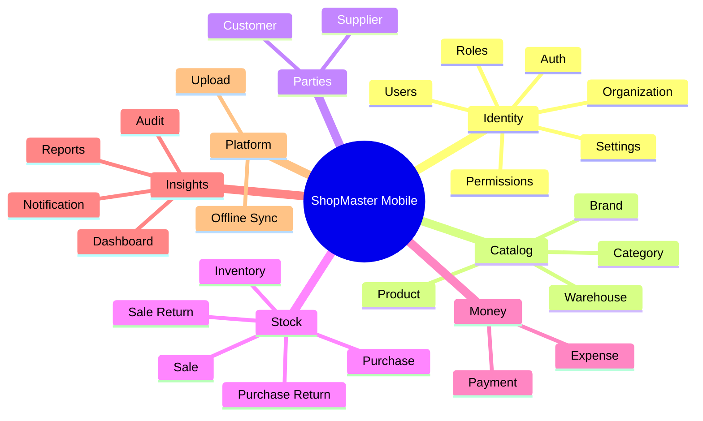
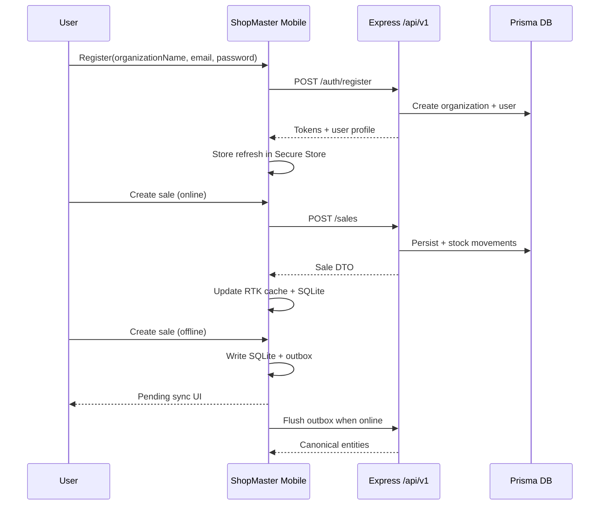

# Project Overview — ShopMaster Mobile

ShopMaster Mobile is the native client for the ShopMaster shop ERP platform. It enables retail businesses to run day-to-day operations from a phone or tablet while staying synchronized with the Express + Prisma backend at `/api/v1/*`.

This document describes business goals, target users, product features (aligned with backend modules), future scope, and non-functional requirements that every engineering decision must honor.

---

## 1. Business Goals

### 1.1 Primary goals

1. **Put the ERP on the shop floor**  
   Cashiers and managers should not need a desktop to sell, check stock, receive purchases, or record expenses.

2. **Reduce operational friction**  
   Fast barcode-friendly product search, one-thumb POS flows, and clear payment/return paths cut average transaction time.

3. **Protect revenue with accurate stock & money**  
   Inventory movements, purchases, sales, returns, and payments must stay consistent with server rules (permissions, org scoping, stock policies).

4. **Work through imperfect connectivity**  
   Many shops have intermittent Wi‑Fi or mobile data. Critical workflows must remain usable offline and reconcile safely online.

5. **Scale to multi-user organizations**  
   Roles and permissions from the backend must gate every sensitive action on the device.

6. **Deliver a premium product experience**  
   The app is a commercial product. Visual quality, motion, and reliability are part of the value proposition—not polish deferred to “later.”

### 1.2 Success metrics (product)

| Metric | Target direction |
|---|---|
| Time to complete a simple sale | Continuously reduce |
| Sync failure rate after reconnect | Near zero with clear recovery UX |
| Crash-free sessions | Industry-leading for RN/Expo |
| Permission-related support tickets | Minimal (clear deny UX) |
| Offline→online duplicate documents | Zero (idempotent outbox) |

### 1.3 Business constraints

- Multi-tenant: every entity is scoped to the caller’s **organization**.
- Auth model: **JWT access + refresh tokens**; registration requires **`organizationName`**.
- Feature delivery must follow the backend module order unless product explicitly reprioritizes.

---

## 2. Target Users

### 2.1 Shop Owner

**Goals:** Understand business health, configure organization, manage users/roles, review reports, control settings.

**Typical tasks:**

- View dashboard summaries (today / week / month).
- Configure organization profile and org settings.
- Invite or manage users and assign roles.
- Review profit & loss and inventory reports.
- Approve or monitor large purchases and expenses.

**UX priorities:** Clear KPIs, trustworthy charts, audit visibility, settings that are hard to misconfigure.

### 2.2 Store / Operations Manager

**Goals:** Keep catalog and stock accurate; supervise purchasing, receiving, and returns.

**Typical tasks:**

- Maintain products, brands, categories, warehouses.
- Create and receive purchases; process purchase returns.
- Adjust inventory with reason codes.
- Monitor low-stock and movement history.
- Oversee staff sales and payment collections.

**UX priorities:** Efficient list/filter tools, bulk-friendly forms, strong validation feedback, warehouse context always visible.

### 2.3 Cashier / Sales Associate

**Goals:** Complete sales quickly and correctly; process returns and payments; look up customers and products.

**Typical tasks:**

- Create sales (draft → complete).
- Print/share invoice payload views.
- Take payments (IN) linked to sales.
- Create sale returns within allowed quantities.
- Search customers and products under time pressure.

**UX priorities:** Large touch targets, minimal steps, offline resilience for POS, unmistakable success/error feedback, keyboard-friendly numeric entry.

### 2.4 Cross-cutting personas

| Persona | Notes |
|---|---|
| Super admin (rare on mobile) | Org listing/admin may be web-first; mobile focuses on tenant user flows |
| Accountant (light) | Expenses, payments, reports consumption |
| Auditor (read-only) | Audit log browsing with filters |

Permission keys from the API (e.g. `sales:write`, `inventory:read`) are the source of truth for what each persona can do.

---

## 3. Main Features

Features mirror the ShopMaster backend modules. Mobile delivery order should follow [MODULE_ORDER.md](./MODULE_ORDER.md).

### 3.1 Authentication

- Register with email, password, and **organizationName** (creates org + user).
- Login, logout, refresh-token rotation.
- Secure session restore on cold start.
- Auth-gated navigation trees.

### 3.2 Users

- List, view, create, update, deactivate users within the organization.
- Profile self-service where API allows.

### 3.3 Roles

- CRUD roles.
- Assign permission sets to roles.
- Role picker when managing users.

### 3.4 Permissions

- Browse permission catalog.
- Bind permissions to roles.
- Client-side capability checks for UI gating (server remains authoritative).

### 3.5 Organization

- View/update current organization (`/organizations/me`).
- Super-admin org administration only if product enables it on mobile.

### 3.6 Settings

- User theme preference (`LIGHT` | `DARK`) synced with `/settings/me`.
- Organization keyed settings (invoice prefixes, stock policies, etc.).
- Local overrides only when explicitly allowed (never for security-sensitive flags).

### 3.7 Customer

- Customer CRUD with soft deactivate.
- Search and select in sales/payment flows.
- Org-scoped lists with pagination.

### 3.8 Supplier

- Supplier CRUD.
- Search and select in purchase flows.

### 3.9 Brand

- Brand CRUD; unique name per organization.
- Attach brands to products.

### 3.10 Category

- Category CRUD with optional parent (tree).
- Category picker with hierarchy presentation.

### 3.11 Warehouse

- Warehouse CRUD; default warehouse flag.
- Context switcher for inventory/sales/purchases.

### 3.12 Product

- Product CRUD; unique SKU per organization.
- Search endpoint integration.
- Opening stock on create when warehouse provided.
- Stock patch actions as exposed by API.

### 3.13 Inventory

- Stock list with filters (warehouse, product, search, low stock).
- Movement history.
- Stock adjustments with signed quantities (reject negative results per API).

### 3.14 Purchase

- Create draft/ordered purchases with line totals (`qty * unitCost - discount + tax%`).
- List/detail/update draft/cancel rules.
- Receive goods → stock IN + status `PARTIAL` / `RECEIVED`.
- Document numbering via org settings.

### 3.15 Purchase Return

- Create completed returns within receivable quantities.
- Stock OUT via purchase-return movements.
- List/detail with filters.

### 3.16 Sale

- Create sales (draft or completed).
- Line totals (`qty * unitPrice - discount + tax%`).
- Complete draft → stock OUT honouring `sale.allow_negative_stock`.
- Invoice payload view.
- Cancel draft-only rules.

### 3.17 Sale Return

- Create completed returns within sold quantities.
- Stock IN via sale-return movements.
- List/detail with filters.

### 3.18 Payment

- Record IN/OUT payments.
- Optionally link `saleId` / `purchaseId`.
- Reflect paid amounts and payment status.

### 3.19 Expense

- Expense categories and expenses CRUD.
- Filtering and reporting entry points.

### 3.20 Dashboard

- Summary, today, weekly, monthly.
- Charts, top products, top customers.
- Home landing for owners/managers.

### 3.21 Reports

- Sales, purchases, inventory, expenses, profit-loss.
- Date filters and export/share affordances where feasible.

### 3.22 Notification

- In-app notification list.
- Mark one / mark all read.
- Delete; unread badges in navigation.

### 3.23 Audit

- Read-only audit log browser with filters.
- Support investigations and compliance.

### 3.24 Upload

- Multipart image/file upload for products and attachments.
- List/get/delete uploaded assets.
- Use `expo-image` for display; never block UI on large uploads without progress.

### Feature map

---

## 4. Future Scope

The following are intentionally **out of the first production baseline** unless product prioritizes them. Designs should not block these extensions.

| Area | Direction |
|---|---|
| Multi-warehouse transfers | Dedicated transfer documents and approvals |
| Barcode / camera scanning | Hardware scanner + camera SKU capture |
| Hardware printers | ESC/POS / AirPrint invoice printing |
| Accounting export | CSV/PDF packs, QuickBooks/Xero connectors |
| Multi-currency UX | Beyond org default currency |
| Loyalty & gift cards | Customer balance programs |
| E-commerce sync | Channel inventory mirroring |
| Push notifications | FCM/APNs for low stock and payment events |
| Biometric unlock | Local gate over existing Secure Store session |
| Tablet-optimized POS layout | Dual-pane cart + catalog |
| Staff time / shift cash drawer | Opening/closing float reconciliation |
| AI assistants | Natural-language sales search / insights (privacy-reviewed) |

When a future item lands, update this section, [MODULE_ORDER.md](./MODULE_ORDER.md), and the relevant architecture docs in the same PR.

---

## 5. Non-Functional Requirements (NFRs)

### 5.1 Performance

| Requirement | Detail |
|---|---|
| Frame rate | Target 60 FPS; respect 120 Hz where available |
| List scrolling | FlashList for all unbounded lists |
| Startup | Auth restore + shell interactive quickly; defer heavy sync |
| Images | `expo-image` caching; sized correctly for density |
| JS work | Keep Reanimated worklets off the JS thread when animating |

### 5.2 Reliability & offline

| Requirement | Detail |
|---|---|
| Offline POS & catalog read | Local SQLite cache for essential entities |
| Mutation durability | Outbox queue survives process death |
| Idempotency | Client-generated keys prevent duplicate server docs |
| Sync visibility | Global sync status indicator + per-item states |
| Conflict policy | Documented per entity in Sync Engine guide |

### 5.3 Security

| Requirement | Detail |
|---|---|
| Tokens | Access in memory; refresh in Secure Store |
| Transport | HTTPS in staging/production |
| PII | Minimize logs; redact tokens and passwords |
| Permissions | Hide/disable unauthorized actions; never rely on UI alone |
| Storage | No secrets in MMKV, AsyncStorage, or source control |

### 5.4 Usability & accessibility

| Requirement | Detail |
|---|---|
| Touch targets | Minimum ~48 dp |
| Contrast | Meet WCAG AA for text on surfaces |
| Screen reader | Meaningful labels on interactive controls |
| States | Every screen: loading, empty, error, offline, retry |
| Locale-ready layout | Avoid hard-coded English widths that break translation |

### 5.5 Maintainability

| Requirement | Detail |
|---|---|
| Architecture | Feature-based Clean Architecture |
| Typing | Strict TypeScript end-to-end |
| Modules | Independent feature folders with clear public exports |
| Docs | Architecture and conventions kept current |
| Testability | Pure mappers/services unit-tested |

### 5.6 Compatibility

| Requirement | Detail |
|---|---|
| Platforms | iOS and Android via Expo |
| Devices | Phones first; tablets gracefully adaptive |
| API | Compatible with ShopMaster server `/api/v1` contracts |
| Theme | Light/dark via settings + system preference rules |

### 5.7 Observability

| Requirement | Detail |
|---|---|
| Errors | Structured client error reporting (PII-safe) |
| Sync metrics | Success/fail counts for outbox processing |
| Audit alignment | User actions that mutate business data remain server-audited |

### 5.8 Compliance posture

- Soft deletes / deactivation patterns must match API (no hard delete assumptions).
- Financial documents (sales, purchases, payments) require clear confirmation for destructive cancels.
- Audit log is read-only on mobile.

---

## 6. Product Principles

1. **Server is source of truth** — Local cache is an accelerator, not a second ledger.  
2. **Permissions before chrome** — Do not show write UIs the user cannot execute.  
3. **One job per screen** — Avoid dashboard clutter on transactional screens.  
4. **Calm feedback** — Prefer clear status text and subtle motion over aggressive alerts.  
5. **Module discipline** — Finish one module before starting the next.  
6. **Design system fidelity** — Premium green MD3 tokens, Inter, 8pt spacing everywhere.

---

## 7. Relationship to Backend

Backend module progress and endpoint summaries live in `server/README.md` and Swagger UI at `/docs`.

---

## 8. Document control

| Item | Value |
|---|---|
| Audience | Mobile engineers, tech leads, AI coding agents |
| Companion docs | [ARCHITECTURE.md](./ARCHITECTURE.md), [FOLDER_STRUCTURE.md](./FOLDER_STRUCTURE.md), [MODULE_ORDER.md](./MODULE_ORDER.md) |
| Change policy | Update with product scope or NFR changes in the same PR |
