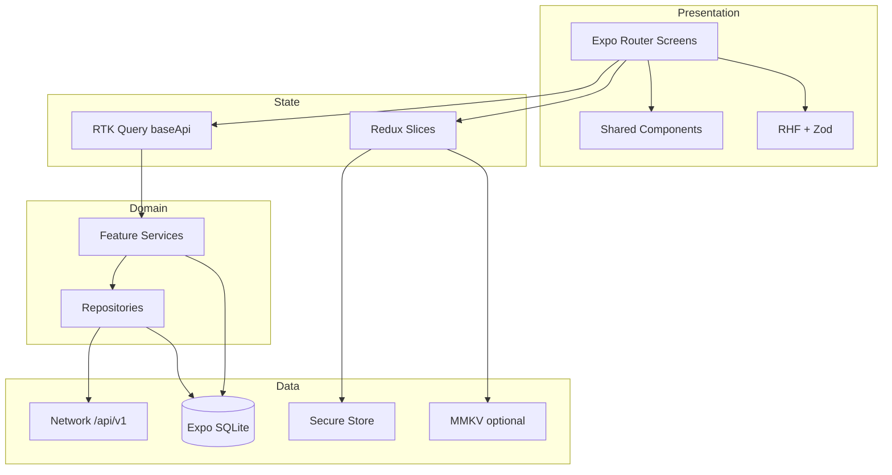

# ShopMaster Mobile — Documentation Hub

> Production-grade mobile ERP for retail shops, built with React Native (Expo), TypeScript, and an offline-first architecture.

This documentation set is the single source of truth for the ShopMaster mobile application. A senior engineer joining the project should be able to understand vision, architecture, conventions, and delivery workflow from these pages alone.

---

## Project Vision

ShopMaster Mobile brings the full shop ERP experience to phones and tablets used on the shop floor. Shop owners, managers, and cashiers must be able to sell, receive stock, check inventory, and review performance — whether they are online or briefly offline.

The product goals are:

1. **Parity with the ShopMaster backend** — Every server module under `/api/v1/*` has a corresponding mobile surface, gated by roles and permissions.
2. **Offline-first reliability** — Critical POS and inventory actions queue locally in SQLite and sync when connectivity returns.
3. **Premium, calm UX** — Material Design 3 with a green brand system, Inter typography, and 8-point spacing. The app should feel as polished as Google Wallet or Notion Mobile: subtle motion, large touch targets, no clutter.
4. **Enterprise maintainability** — Feature-based Clean Architecture, RTK Query for server state, Redux Toolkit for client state, and strict TypeScript throughout.

---

## Architecture Summary

ShopMaster Mobile uses **feature-based Clean Architecture**:

| Layer | Responsibility |
|---|---|
| **Presentation** | Expo Router screens, shared UI, forms (React Hook Form + Zod), animations |
| **State** | Redux Toolkit slices + RTK Query (`baseApi`) for remote data |
| **Domain / Service** | Use-case oriented services inside each feature |
| **Data / Repository** | API adapters, mappers, DTO ↔ domain mapping |
| **Offline** | Expo SQLite cache, mutation queue, sync engine, conflict policies |
| **Network** | Authenticated fetch base, JWT refresh, retry, upload helpers |
| **Navigation** | Typed Expo Router routes, deep links, auth guards |
| **Theme** | MD3 tokens: color, typography, spacing, elevation, dark mode |



Authentication uses **JWT access tokens + refresh tokens**. Access tokens live in memory (and optionally MMKV for non-secret session metadata). Refresh tokens and any long-lived secrets live in **Expo Secure Store**. Register requires `organizationName` and creates organization + first user in one backend transaction.

Backend base path: **`/api/v1/*`**.

---

## Tech Stack

| Concern | Technology | Notes |
|---|---|---|
| Runtime | React Native + Expo (latest stable SDK) | Managed workflow preferred |
| Routing | Expo Router | File-based routes under `app/` |
| Language | TypeScript (strict) | No `any` without explicit justification |
| Server state | Redux Toolkit + RTK Query | Tag-based cache invalidation |
| Client state | Redux Toolkit slices | Auth session, UI prefs, sync status |
| Forms | React Hook Form + Zod | Schema-first validation |
| Secure storage | Expo Secure Store | Refresh tokens, device secrets |
| Local DB | Expo SQLite | Offline cache + outbox queue |
| Fast KV (optional) | react-native-mmkv | Non-secret prefs, flags, drafts |
| Lists | @shopify/flash-list | All long lists |
| Images | expo-image | Caching + placeholders |
| Animation | Reanimated + Gesture Handler | 60/120 FPS micro-interactions |
| Icons / vectors | react-native-svg | |
| Motion assets | Lottie | Empty / success / loading moments |
| Sheets | @gorhom/bottom-sheet | Filters, actions, pickers |
| Styling | NativeWind v4 + Tailwind CSS v3 | Utility `className`; tokens in `tailwind.config.js` |
| Design | Material Design 3 | Premium green brand, Inter, 8pt grid |

**Do not introduce alternate stacks** (e.g. React Query, Zustand, StyleSheet-only theming without tokens) without an architecture decision record approved by the team.

---

## Folder Structure Overview

```text
mobileApp/
├── docs/                      # This documentation set
├── app/                       # Expo Router entry & routes
├── src/
│   ├── features/              # One folder per ERP module
│   ├── shared/                # Cross-cutting UI, hooks, utils, constants
│   ├── store/                 # configureStore, baseApi, middleware
│   ├── theme/                 # Colors, typography, spacing, MD3 themes
│   ├── offline/               # SQLite, queue, sync engine
│   ├── navigation/            # Route types, helpers, link builders
│   └── types/                 # Global shared TypeScript types
└── assets/                    # Images, lottie, fonts
```

Full explanation of every folder, naming rules, and feature internals: [FOLDER_STRUCTURE.md](./FOLDER_STRUCTURE.md).

---

## Getting Started

### Prerequisites

- Node.js LTS (match `.nvmrc` when present)
- Yarn or npm (prefer Yarn if the repo standardizes on it)
- Expo CLI / `npx expo`
- iOS Simulator (macOS) and/or Android emulator / physical device
- Running ShopMaster API (`server/`) with migrations applied

### Environment

Create `mobileApp/.env` (or Expo public env files as documented in API integration docs):

```bash
EXPO_PUBLIC_API_BASE_URL=http://localhost:3000/api/v1
EXPO_PUBLIC_APP_ENV=development
```

Use your machine LAN IP for physical devices instead of `localhost`.

### Install & run

```bash
cd mobileApp
yarn install
yarn start
```

Then press `i` (iOS), `a` (Android), or scan the QR code with Expo Go / a development build.

> **Package manager:** Yarn 4 only (`packageManager: yarn@4.9.2`), same as `server/`. Do not use npm.

### First login / register

1. Ensure the API is healthy (`GET /api/v1/...` or Swagger at `/docs`).
2. Register with email, password, and **organizationName** (required).
3. Subsequent logins use JWT + refresh rotation handled by the auth feature and RTK Query base query.

### Verify offline path (smoke)

1. Sign in and open Products or Sales.
2. Enable airplane mode.
3. Create a draft sale or local-safe mutation.
4. Confirm the item appears in the local outbox / sync indicator.
5. Restore network and confirm sync completes without duplicates.

---

## Coding Standards

| Rule | Expectation |
|---|---|
| TypeScript | Strict mode; explicit return types on public APIs |
| Features | All ERP logic lives under `src/features/<module>/` |
| Imports | Prefer absolute aliases (`@/features/...`, `@/shared/...`) |
| UI | NativeWind `className` + design-system primitives; no raw hex |
| Forms | Zod schema → React Hook Form resolver; never ad-hoc string checks |
| Lists | FlashList for any scrollable collection of unknown length |
| Images | `expo-image` only |
| Secrets | Never log tokens; never store refresh tokens outside Secure Store |
| Commits | Conventional, module-scoped messages (`feat(sale): ...`) |
| Tests | Unit for mappers/services; integration for sync/auth critical paths |
| Docs | Update the matching doc when changing architecture or conventions |

Detailed style rules: [CODE_STYLE.md](./CODE_STYLE.md) · Agent constraints: [AI_AGENT_RULES.md](./AI_AGENT_RULES.md).

---

## Development Workflow

Work **module by module** in the order defined in [MODULE_ORDER.md](./MODULE_ORDER.md). Do not open multiple unfinished modules in parallel.

A mobile feature module is complete only when all of the following are done:

1. Types & Zod schemas  
2. RTK Query API slice (or offline repository)  
3. Repository / service layer  
4. Screens & navigation routes  
5. Shared UI reuse (no duplicate primitives)  
6. Loading / empty / error / offline states  
7. Permission gating  
8. Offline behavior (where required by the module)  
9. Unit tests for mappers & critical reducers  
10. Manual QA checklist for the module  

Daily loop:


See [DEVELOPMENT_WORKFLOW.md](./DEVELOPMENT_WORKFLOW.md) and [MODULE_DEVELOPMENT_GUIDE.md](./MODULE_DEVELOPMENT_GUIDE.md).

---

## Documentation Index

### Foundations

| Document | Description |
|---|---|
| [README.md](./README.md) | Vision, stack, getting started, index (this file) |
| [PROJECT_OVERVIEW.md](./PROJECT_OVERVIEW.md) | Business goals, users, features, NFRs, future scope |
| [ARCHITECTURE.md](./ARCHITECTURE.md) | Clean Architecture layers, patterns, diagrams |
| [FOLDER_STRUCTURE.md](./FOLDER_STRUCTURE.md) | Every folder explained + naming conventions |

### State & data

| Document | Description |
|---|---|
| [STATE_MANAGEMENT.md](./STATE_MANAGEMENT.md) | Redux vs RTK Query vs local state decision guide |
| [RTK_QUERY_GUIDE.md](./RTK_QUERY_GUIDE.md) | `baseApi`, tags, cache, pagination, optimistic updates |
| [REDUX_GUIDE.md](./REDUX_GUIDE.md) | Slices, middleware, persistence boundaries |
| [API_INTEGRATION.md](./API_INTEGRATION.md) | `/api/v1` contracts, headers, errors, uploads |
| [AUTHENTICATION.md](./AUTHENTICATION.md) | JWT, refresh, register (`organizationName`), guards |

### Offline & storage

| Document | Description |
|---|---|
| [OFFLINE_FIRST.md](./OFFLINE_FIRST.md) | Offline product principles and screen contracts |
| [SYNC_ENGINE.md](./SYNC_ENGINE.md) | Outbox, retries, conflict resolution, background sync |
| [DATABASE_GUIDE.md](./DATABASE_GUIDE.md) | Expo SQLite schema, migrations, repositories |

### Design system

| Document | Description |
|---|---|
| [TAILWIND_GUIDE.md](./TAILWIND_GUIDE.md) | NativeWind setup, `className` rules, `cn()` utility |
| [THEME_GUIDE.md](./THEME_GUIDE.md) | Theme provider, light/dark, MD3 mapping |
| [DESIGN_SYSTEM.md](./DESIGN_SYSTEM.md) | Overall visual language and component inventory |
| [COLOR_SYSTEM.md](./COLOR_SYSTEM.md) | Premium green palette and semantic tokens |
| [TYPOGRAPHY.md](./TYPOGRAPHY.md) | Inter scale: display → label |
| [SPACING_SYSTEM.md](./SPACING_SYSTEM.md) | 8-point spacing rules |
| [COMPONENT_GUIDELINES.md](./COMPONENT_GUIDELINES.md) | Buttons, fields, sheets, lists, FAB, etc. |
| [UI_GUIDELINES.md](./UI_GUIDELINES.md) | Layout density, cards, elevation, whitespace |
| [UX_GUIDELINES.md](./UX_GUIDELINES.md) | Flows, feedback, confirmation patterns |
| [ANIMATION_GUIDELINES.md](./ANIMATION_GUIDELINES.md) | Subtle motion standards |

### Screens & interaction

| Document | Description |
|---|---|
| [NAVIGATION_GUIDE.md](./NAVIGATION_GUIDE.md) | Expo Router trees, auth gates, deep links |
| [SCREEN_STANDARDS.md](./SCREEN_STANDARDS.md) | Required states on every screen |
| [FORM_GUIDELINES.md](./FORM_GUIDELINES.md) | RHF + Zod patterns |
| [ERROR_HANDLING.md](./ERROR_HANDLING.md) | API, form, offline, and fatal errors |
| [LOADING_STATES.md](./LOADING_STATES.md) | Skeletons, spinners, progressive loading |
| [EMPTY_STATES.md](./EMPTY_STATES.md) | Empty copy, illustration, CTA rules |
| [ACCESSIBILITY.md](./ACCESSIBILITY.md) | Labels, focus, contrast, screen readers |
| [RESPONSIVENESS.md](./RESPONSIVENESS.md) | Phone / tablet adaptive layouts |

### Quality & delivery

| Document | Description |
|---|---|
| [PERFORMANCE_GUIDE.md](./PERFORMANCE_GUIDE.md) | 60/120 FPS, FlashList, image, JS thread |
| [SECURITY_GUIDE.md](./SECURITY_GUIDE.md) | Tokens, storage, TLS, PII |
| [TESTING_GUIDE.md](./TESTING_GUIDE.md) | Unit, component, e2e strategy |
| [CODE_STYLE.md](./CODE_STYLE.md) | Lint, format, naming, file layout |
| [AI_AGENT_RULES.md](./AI_AGENT_RULES.md) | Rules for Cursor / AI agents |
| [DEVELOPMENT_WORKFLOW.md](./DEVELOPMENT_WORKFLOW.md) | Day-to-day engineering process |
| [MODULE_DEVELOPMENT_GUIDE.md](./MODULE_DEVELOPMENT_GUIDE.md) | How to build one feature end-to-end |
| [MODULE_ORDER.md](./MODULE_ORDER.md) | Build order matching backend modules |
| [RELEASE_CHECKLIST.md](./RELEASE_CHECKLIST.md) | Store / OTA release gates |
| [CONTRIBUTING.md](./CONTRIBUTING.md) | PR process, reviews, branching |

---

## Related repositories

| Path | Role |
|---|---|
| `server/` | Express + Prisma API (`/api/v1/*`), Swagger at `/docs` |
| `doc/backend/server/` | Backend AI / API working notes |
| `doc/mobile/mobile/` | Mobile AI agent bootstrap instructions |

---

## Ownership

Documentation changes ship with the same PR as the architectural or convention change they describe. Prefer updating these files over leaving tribal knowledge in chat threads.
