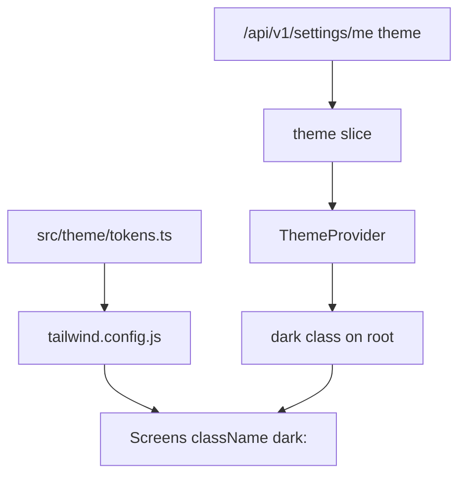

# Theme Guide — ShopMaster Mobile

The theme system connects **user preference**, **system appearance**, **Tailwind / NativeWind dark mode**, and **Material Design 3 semantics**. All visual styling flows from tokens → `tailwind.config.js` → `className` utilities.

---

## Table of Contents

1. [Architecture](#architecture)
2. [Theme Modes](#theme-modes)
3. [ThemeProvider](#themeprovider)
4. [Settings Sync](#settings-sync)
5. [MD3 Mapping](#md3-mapping)
6. [Font Loading](#font-loading)
7. [Elevation & Shadows](#elevation--shadows)
8. [Status Bar & Navigation Bar](#status-bar--navigation-bar)
9. [Testing Themes](#testing-themes)
10. [Related Docs](#related-docs)

---

## Architecture



| Layer | Responsibility |
|---|---|
| `src/theme/tokens.ts` | Canonical color, spacing, radius, typography values |
| `tailwind.config.js` | Exposes tokens as Tailwind theme extensions |
| `ThemeProvider` | Resolves light/dark/system; applies `dark` class |
| `theme` Redux slice | Persists user preference locally (MMKV) + syncs API |
| Screens | Consume only semantic Tailwind classes |

---

## Theme Modes

| Mode | Source | Resolved appearance |
|---|---|---|
| `LIGHT` | User setting | Always light tokens |
| `DARK` | User setting | Always dark tokens |
| `SYSTEM` | Device `useColorScheme()` | Follows OS |

Backend stores theme on user settings: `GET/PATCH /api/v1/settings/me` with `theme: 'LIGHT' | 'DARK'`.

Mobile maps:

```typescript
export type ThemePreference = 'light' | 'dark' | 'system';

export function mapApiTheme(api: 'LIGHT' | 'DARK' | null | undefined): ThemePreference {
  if (api === 'LIGHT') return 'light';
  if (api === 'DARK') return 'dark';
  return 'system';
}
```

---

## ThemeProvider

Mount at root in `app/_layout.tsx`, inside Redux `Provider`, wrapping navigation:

```tsx
// app/_layout.tsx (excerpt)
import '../global.css';
import { Provider } from 'react-redux';
import { store } from '@/store';
import { ThemeProvider } from '@/theme/ThemeProvider';
import { GestureHandlerRootView } from 'react-native-gesture-handler';
import { BottomSheetModalProvider } from '@gorhom/bottom-sheet';

export default function RootLayout() {
  return (
    <GestureHandlerRootView className="flex-1">
      <Provider store={store}>
        <ThemeProvider>
          <BottomSheetModalProvider>
            <Stack />
          </BottomSheetModalProvider>
        </ThemeProvider>
      </Provider>
    </GestureHandlerRootView>
  );
}
```

```tsx
// src/theme/ThemeProvider.tsx
import { View } from 'react-native';
import { useColorScheme } from 'nativewind';
import { StatusBar } from 'expo-status-bar';
import { useAppSelector } from '@/store/hooks';
import { cn } from './cn';

export function ThemeProvider({ children }: { children: React.ReactNode }) {
  const preference = useAppSelector((s) => s.theme.preference);
  const systemScheme = useColorScheme();
  const resolved =
    preference === 'system'
      ? (systemScheme ?? 'light')
      : preference;

  const isDark = resolved === 'dark';

  return (
    <View className={cn('flex-1 bg-background', isDark && 'dark')}>
      <StatusBar style={isDark ? 'light' : 'dark'} />
      {children}
    </View>
  );
}
```

---

## Settings Sync

On login, fetch settings and hydrate theme slice:

```typescript
// src/features/settings/slices/theme.slice.ts (conceptual)
import { createSlice, PayloadAction } from '@reduxjs/toolkit';
import type { ThemePreference } from '@/theme/types';

type ThemeState = { preference: ThemePreference };

const initialState: ThemeState = { preference: 'system' };

const themeSlice = createSlice({
  name: 'theme',
  initialState,
  reducers: {
    setPreference(state, action: PayloadAction<ThemePreference>) {
      state.preference = action.payload;
    },
  },
});

export const { setPreference } = themeSlice.actions;
export default themeSlice.reducer;
```

When user toggles theme in Profile/Settings:

1. Optimistically `dispatch(setPreference(...))`
2. `PATCH /api/v1/settings/me` with `{ theme: 'LIGHT' | 'DARK' }`
3. On failure, revert and show snackbar

Persist preference in MMKV (`theme.preference`) for instant startup before network.

---

## MD3 Mapping

Material Design 3 roles map to Tailwind semantic tokens:

| MD3 role | Tailwind token | Usage |
|---|---|---|
| `primary` | `bg-primary`, `text-primary` | FAB, key CTAs, active tab |
| `onPrimary` | `text-primary-on` | Text on primary surfaces |
| `primaryContainer` | `bg-primary-container` | Chips, selected filters |
| `onPrimaryContainer` | `text-primary-dark` | Text on container |
| `surface` | `bg-surface` | Cards, sheets, inputs |
| `onSurface` | `text-foreground` | Primary text |
| `surfaceVariant` | `bg-surface-dim` | Grouped backgrounds |
| `outline` | `border-border` | Dividers, input borders |
| `error` | `text-danger`, `border-danger` | Validation, destructive |
| `secondary` | `bg-secondary` | Secondary buttons |
| `tertiary` / accent | `text-accent` | Highlights, badges |

MD3 elevation is expressed via `shadow-sm`, `shadow-md`, `shadow-lg` tokens defined in [DESIGN_SYSTEM.md](./DESIGN_SYSTEM.md).

---

## Font Loading

Inter loads via `expo-font` before hiding splash:

```tsx
// app/_layout.tsx
import { useFonts } from 'expo-font';
import * as SplashScreen from 'expo-splash-screen';

SplashScreen.preventAutoHideAsync();

const [loaded] = useFonts({
  'Inter-Regular': require('@/assets/fonts/Inter-Regular.ttf'),
  'Inter-Medium': require('@/assets/fonts/Inter-Medium.ttf'),
  'Inter-SemiBold': require('@/assets/fonts/Inter-SemiBold.ttf'),
  'Inter-Bold': require('@/assets/fonts/Inter-Bold.ttf'),
});

useEffect(() => {
  if (loaded) SplashScreen.hideAsync();
}, [loaded]);

if (!loaded) return null;
```

Tailwind `fontFamily` keys (`font-sans`, `font-sans-medium`, etc.) must match loaded font names exactly.

---

## Elevation & Shadows

Use shared elevation utilities — do not invent per-screen shadow values:

| Level | Tailwind | Use |
|---|---|---|
| 0 | none | Flat lists |
| 1 | `shadow-sm` | Cards on background |
| 2 | `shadow-md` | FAB, dropdown |
| 3 | `shadow-lg` | Modals, bottom sheets |

Android: shared `Card` component sets `elevation` style prop alongside iOS shadow classes.

---

## Status Bar & Navigation Bar

- `expo-status-bar`: `style="light"` when `dark`, `"dark"` when light (see ThemeProvider).
- Android navigation bar: configure via `expo-navigation-bar` if brand requires immersive dark nav; default Expo behavior is acceptable for v1.

---

## Testing Themes

Manual checklist:

1. Toggle system dark mode with app set to `SYSTEM` — UI follows OS.
2. Force `LIGHT` in settings — UI stays light regardless of OS.
3. Force `DARK` — all `dark:` variants apply; contrast passes WCAG AA on primary text.
4. Kill app and relaunch — MMKV restores preference before API returns.
5. Logout/login — settings API re-hydrates theme.

Automated: snapshot shared primitives in light and dark using `@testing-library/react-native` with `className` containing `dark`.

---

## Related Docs

- [TAILWIND_GUIDE.md](./TAILWIND_GUIDE.md) — NativeWind setup and class rules
- [COLOR_SYSTEM.md](./COLOR_SYSTEM.md) — Full palette
- [TYPOGRAPHY.md](./TYPOGRAPHY.md) — Type scale
- [SPACING_SYSTEM.md](./SPACING_SYSTEM.md) — 8pt grid
